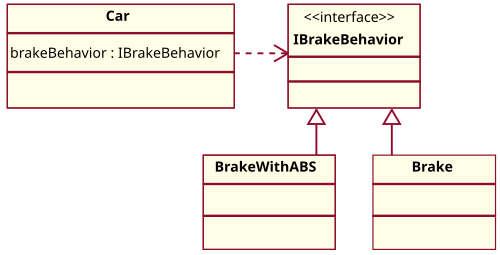

# 전략 패턴 (Strategy Pattern)

## 위키백과 (Wikipedia)

출처: [https://en.wikipedia.org/wiki/Strategy_pattern](https://en.wikipedia.org/wiki/Strategy_pattern)

## 개요

**전략 패턴**(Strategy Pattern)은 실행 중에 알고리즘을 선택할 수 있게 하는 행위 소프트웨어 디자인 패턴입니다. 전략 패턴은 서로 다른 알고리즘을 캡슐화하여 상호 교환 가능하게 만듭니다.

## 주요 특징

- 알고리즘을 사용하는 클라이언트와 독립적으로 알고리즘을 변경할 수 있습니다
- 실행 시점에 알고리즘 구현을 선택할 수 있습니다
- 객체 지향 설계에서 유연성과 재사용성을 촉진합니다

## 핵심 구조

전략 패턴은 다음과 같은 주요 구성 요소로 이루어져 있습니다:

1. **Context 클래스**: Strategy 인터페이스에 대한 참조를 유지합니다
2. **Strategy 인터페이스**: 알고리즘 구현을 위한 공통 메서드를 정의합니다
3. **Concrete Strategy 클래스들**: 특정 알고리즘 변형을 구현합니다

## UML 다이어그램

### 전략 패턴의 UML 구조


## 예제: 자동차 브레이크 동작

이 예제에서는 서로 다른 브레이크 동작을 동적으로 선택할 수 있습니다:



### Java 구현 코드

```java
// 전략 인터페이스
public interface IBrakeBehavior {
    public void brake();
}

// 구체적인 전략 1: ABS 브레이크
public class BrakeWithABS implements IBrakeBehavior {
    public void brake() {
        System.out.println("Brake with ABS applied");
    }
}

// 구체적인 전략 2: 일반 브레이크
public class Brake implements IBrakeBehavior {
    public void brake() {
        System.out.println("Simple Brake applied");
    }
}

// Context 클래스
public abstract class Car {
    private IBrakeBehavior brakeBehavior;

    public Car(IBrakeBehavior brakeBehavior) {
        this.brakeBehavior = brakeBehavior;
    }

    public void applyBrake() {
        brakeBehavior.brake();
    }

    public void setBrakeBehavior(IBrakeBehavior brakeType) {
        this.brakeBehavior = brakeType;
    }
}

// 구체적인 Context 1: 세단
public class Sedan extends Car {
    public Sedan() {
        super(new Brake());
    }
}

// 구체적인 Context 2: SUV
public class SUV extends Car {
    public SUV() {
        super(new BrakeWithABS());
    }
}
```

### 사용 예시

```java
public class Main {
    public static void main(String[] args) {
        // 세단은 일반 브레이크로 시작
        Car sedan = new Sedan();
        sedan.applyBrake(); // 출력: Simple Brake applied

        // SUV는 ABS 브레이크로 시작
        Car suv = new SUV();
        suv.applyBrake(); // 출력: Brake with ABS applied

        // 실행 중에 세단의 브레이크를 ABS로 변경
        sedan.setBrakeBehavior(new BrakeWithABS());
        sedan.applyBrake(); // 출력: Brake with ABS applied
    }
}
```

## 장점

- **알고리즘과 클라이언트 분리**: 알고리즘 구현을 클라이언트로부터 분리합니다
- **런타임 알고리즘 전환**: 실행 중에 알고리즘을 동적으로 변경할 수 있습니다
- **개방-폐쇄 원칙 지원**: 기존 코드를 수정하지 않고 새로운 전략을 추가할 수 있습니다
- **코드 중복 감소**: 공통 인터페이스를 통해 코드 중복을 줄입니다
- **시스템 유연성 증가**: 다양한 알고리즘을 쉽게 교체하고 조합할 수 있습니다

## 관련 패턴

- **의존성 주입** (Dependency Injection)
- **상속보다 합성** (Composition over Inheritance)
- **고차 함수** (Higher-order Function)

## 실제 적용 사례

전략 패턴은 다음과 같은 상황에서 유용하게 사용됩니다:

1. 정렬 알고리즘 선택 (퀵소트, 병합정렬, 버블정렬 등)
2. 압축 알고리즘 선택 (ZIP, RAR, TAR 등)
3. 결제 방법 선택 (신용카드, 페이팔, 은행 송금 등)
4. 검증 전략 선택 (이메일 검증, 전화번호 검증 등)
5. 렌더링 전략 선택 (HTML, PDF, XML 등)

---

*이 문서는 Wikipedia의 Strategy pattern 문서를 한글로 번역한 것입니다.*
