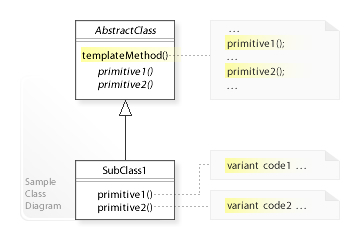

# 템플릿 메서드 패턴 (Template Method Pattern)

*Wikipedia의 Template Method pattern 문서를 한글로 번역한 뒤 스터디 발표를 위해 정리한 문서입니다.* 👉 [https://en.wikipedia.org/wiki/Template_method_pattern](https://en.wikipedia.org/wiki/Template_method_pattern)


---

## 개요

**템플릿 메서드 패턴**(Template Method Pattern)은 객체 지향 프로그래밍에서 알고리즘의 골격을 기본 클래스에서 정의하고, 서브클래스가 특정 단계의 구체적인 구현을 제공할 수 있도록 하는 행위 디자인 패턴 중 하나입니다.

이 패턴은 Gang of Four의 "Design Patterns" 책에서 소개되었으며, 소프트웨어 엔지니어링에서 널리 사용되는 디자인 패턴 중 하나입니다.

---

## 주요 특징

- **상속을 통한 알고리즘 변형**: 상속을 사용하여 알고리즘의 일부를 변경합니다
- **추상 슈퍼클래스에서 템플릿 메서드 구현**: 알고리즘의 골격을 정의합니다
- **상위 수준의 단계 정의**: 헬퍼 메서드를 통해 알고리즘의 주요 단계를 정의합니다
- **훅 메서드와 추상 메서드를 통한 커스터마이징**: 서브클래스가 특정 단계를 재정의할 수 있습니다

---

## 핵심 구조

템플릿 메서드 패턴은 다음과 같은 주요 구성 요소로 이루어져 있습니다:

1. **추상 기본 클래스**: 템플릿 메서드를 포함합니다
2. **템플릿 메서드**: 알고리즘의 골격을 정의하고 추상 메서드나 훅 메서드를 호출합니다
3. **추상 메서드**: 서브클래스에서 반드시 구현해야 하는 메서드입니다
4. **훅 메서드**: 서브클래스에서 선택적으로 재정의할 수 있는 메서드입니다
5. **구체적인 서브클래스**: 추상 메서드를 구현하여 특정 변형을 제공합니다

---

## 템플릿 메서드 패턴의 UML 구조



---

## Java 예제 : 알고리즘의 골격(템플릿 메소드)이 구현되어 있는 추상 클래스

```java
/**
 * 추상 클래스는 템플릿 메서드를 구현하고, 추상 메서드를 선언합니다.
 */
abstract class Game {
    // 템플릿 메서드 - 알고리즘의 골격을 정의
    public final void play() {
        initialize();
        startPlay();
        endPlay();
    }

    // 추상 메서드 - 서브클래스에서 구현
    abstract void initialize();
    abstract void startPlay();
    abstract void endPlay();
}
```
---

## Java 예제 : 추상 클래스인 Game의 Cricket 구현클래스

```java
class Cricket extends Game {
    @Override
    void initialize() {
        System.out.println("Cricket Game Initialized! Start playing.");
    }

    @Override
    void startPlay() {
        System.out.println("Cricket Game Started. Enjoy the game!");
    }

    @Override
    void endPlay() {
        System.out.println("Cricket Game Finished!");
    }
}
```
---

## Java 예제 : 추상 클래스인 Game의 Football 구현 클래스

```java
class Football extends Game {
    @Override
    void initialize() {
        System.out.println("Football Game Initialized! Start playing.");
    }

    @Override
    void startPlay() {
        System.out.println("Football Game Started. Enjoy the game!");
    }

    @Override
    void endPlay() {
        System.out.println("Football Game Finished!");
    }
}
```
---

## Java 예제 : 클라이언트 코드

```java
/**
 * 클라이언트 코드
 */
public class TemplatePatternDemo {
    public static void main(String[] args) {
        Game game = new Cricket();
        game.play();
        game = new Football();
        game.play();
    }
}
```
---
# 감사합니다.
aiiiiiiiden@gmail.com